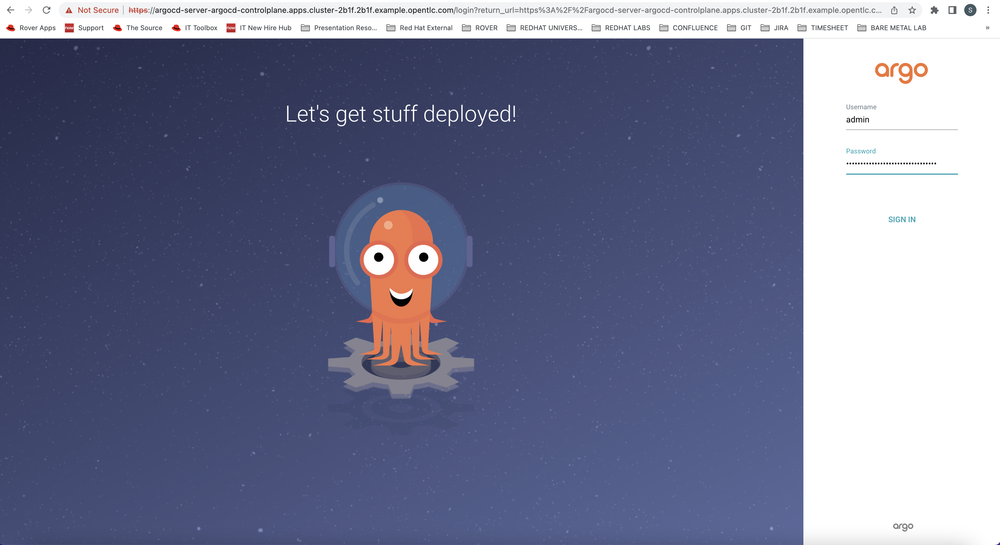
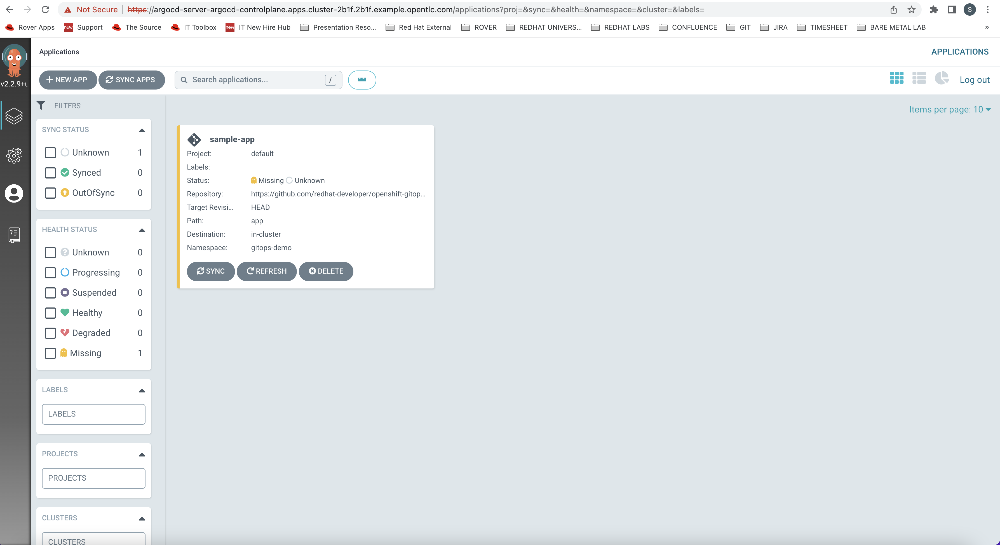
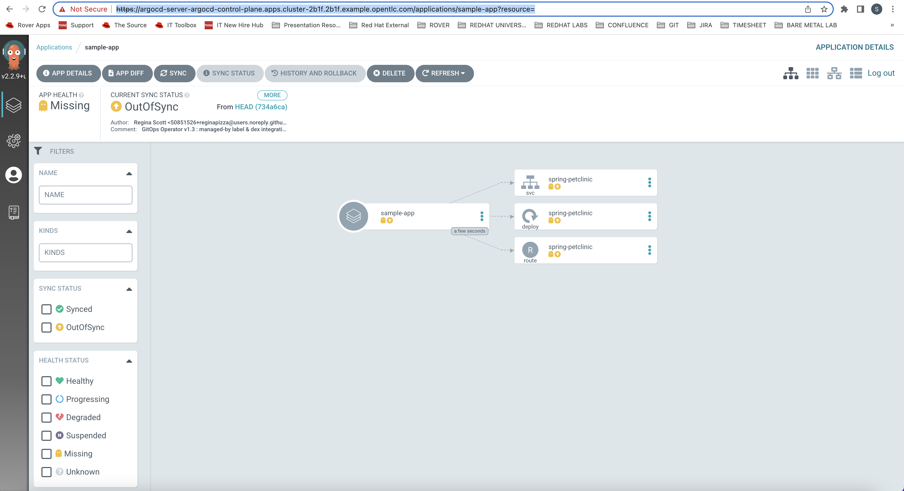
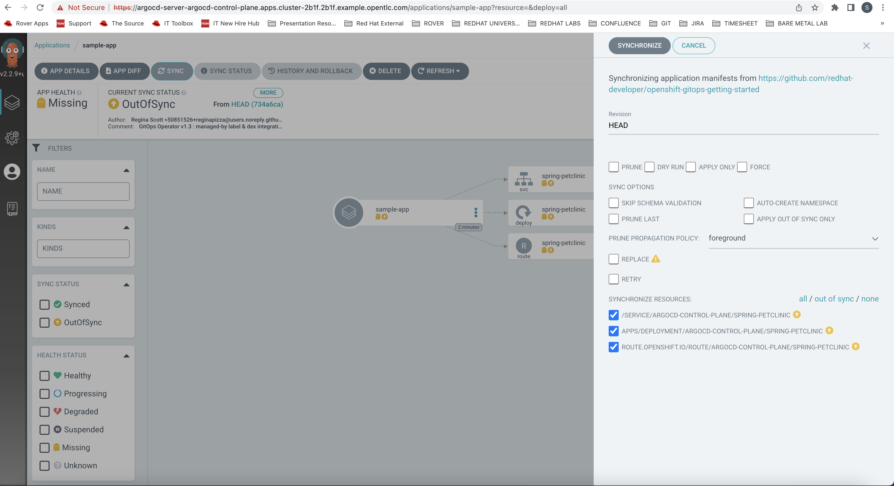
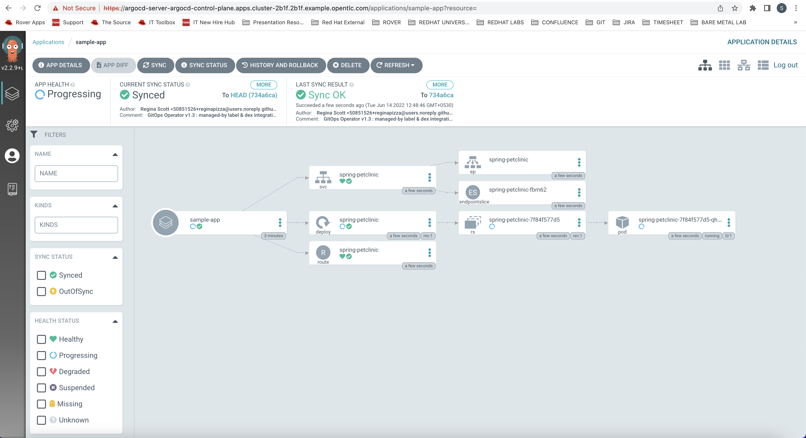
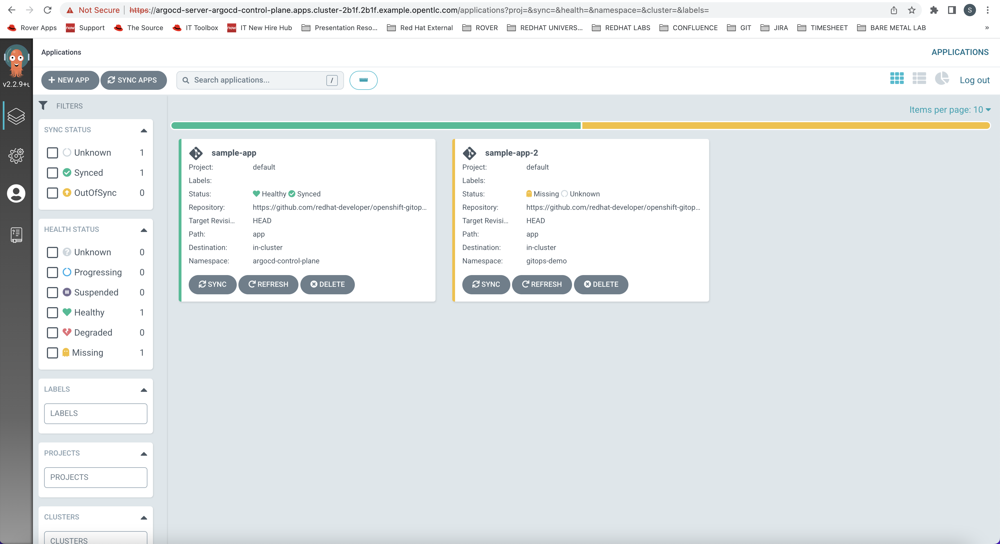
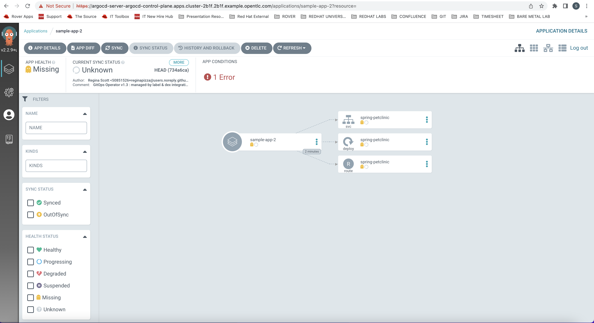
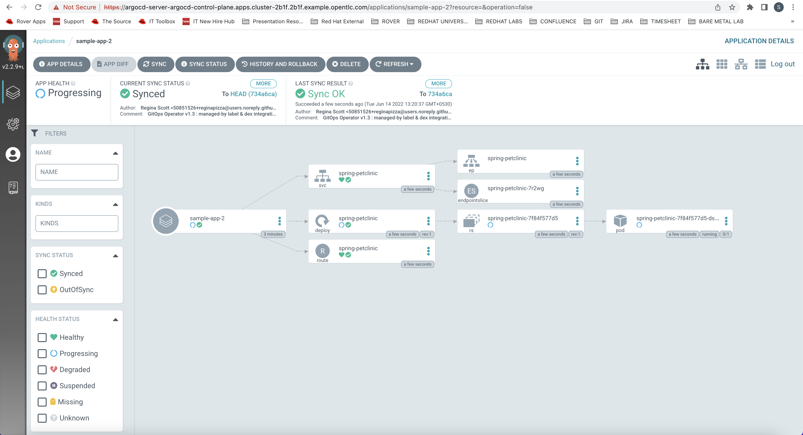
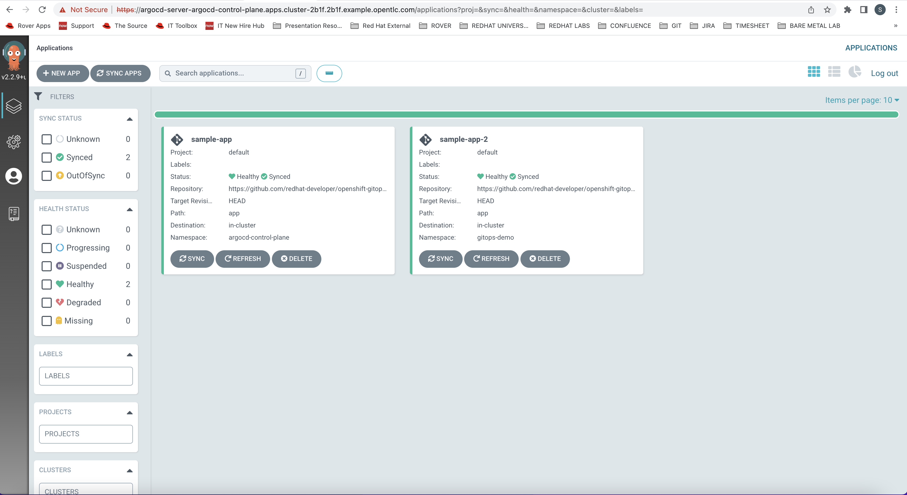

## https://developers.redhat.com/articles/2021/08/03/managing-gitops-control-planes-secure-gitops-practices#

### Steps to deploy the Local ArgoCD in a namespace "argocd-control-plane"

1 create a namespace 
     
    oc new-project argocd-control-plane

2 create a ArgoCD server
    
    apiVersion: argoproj.io/v1alpha1
    kind: ArgoCD
    metadata:
    name: argocd #name of the Argo CD instance
    namespace: argocd-control-plane #namespace where you want to deploy argocd instance
    spec:
    server:
    route:
    enabled: true #creates an openshift route to access Argo CD UI

    skhobrag@Sunils-MacBook-Pro argo % oc create -f argocd.yaml
    argocd.argoproj.io/argocd created

3 Check if the ArgoCD is deployed in 

    skhobrag@Sunils-MacBook-Pro argo % oc get all
    NAME                                      READY   STATUS    RESTARTS   AGE
    pod/argocd-application-controller-0       0/1     Running   0          8s
    pod/argocd-dex-server-c98cf44fb-bgnrp     1/1     Running   0          8s
    pod/argocd-redis-6fb8d68fd5-bpcsj         1/1     Running   0          8s
    pod/argocd-repo-server-7d5b6f889c-5vz6m   0/1     Running   0          8s
    pod/argocd-server-69789bd845-5rl94        0/1     Running   0          8s
    
    NAME                            TYPE        CLUSTER-IP      EXTERNAL-IP   PORT(S)             AGE
    service/argocd-dex-server       ClusterIP   172.30.5.124    <none>        5556/TCP,5557/TCP   8s
    service/argocd-metrics          ClusterIP   172.30.84.119   <none>        8082/TCP            8s
    service/argocd-redis            ClusterIP   172.30.136.13   <none>        6379/TCP            8s
    service/argocd-repo-server      ClusterIP   172.30.88.17    <none>        8081/TCP,8084/TCP   8s
    service/argocd-server           ClusterIP   172.30.219.19   <none>        80/TCP,443/TCP      8s
    service/argocd-server-metrics   ClusterIP   172.30.46.173   <none>        8083/TCP            8s
    
    NAME                                 READY   UP-TO-DATE   AVAILABLE   AGE
    deployment.apps/argocd-dex-server    1/1     1            1           8s
    deployment.apps/argocd-redis         1/1     1            1           8s
    deployment.apps/argocd-repo-server   0/1     1            0           8s
    deployment.apps/argocd-server        0/1     1            0           8s
    
    NAME                                            DESIRED   CURRENT   READY   AGE
    replicaset.apps/argocd-dex-server-c98cf44fb     1         1         1       9s
    replicaset.apps/argocd-redis-6fb8d68fd5         1         1         1       9s
    replicaset.apps/argocd-repo-server-7d5b6f889c   1         1         0       9s
    replicaset.apps/argocd-server-69789bd845        1         1         0       9s
    
    NAME                                             READY   AGE
    statefulset.apps/argocd-application-controller   0/1     9s
    
    NAME                                     HOST/PORT                                                                       PATH   SERVICES        PORT    TERMINATION            WILDCARD
    route.route.openshift.io/argocd-server   argocd-server-argocd-control-plane.apps.cluster-2b1f.2b1f.example.opentlc.com          argocd-server   https   passthrough/Redirect   None
    skhobrag@Sunils-MacBook-Pro argo %

4 get the routes of argo-controlplane
    
    skhobrag@Sunils-MacBook-Pro argo % oc get routes -n argocd-control-plane
    NAME            HOST/PORT                                                                       PATH   SERVICES        PORT    TERMINATION            WILDCARD
    argocd-server   argocd-server-argocd-control-plane.apps.cluster-2b1f.2b1f.example.opentlc.com          argocd-server   https   passthrough/Redirect   None
    skhobrag@Sunils-MacBook-Pro argo %

5 Login to the ArcoCD UI
    
    username: admin
    password: go to argocd-controlplane namespace and see the secret argocd-cluster

6 Create a ArgoCD Application in the namespace "argocd-control-plane" same as the ArgoCD instance is deployed
    
    apiVersion: argoproj.io/v1alpha1
    kind: Application
    metadata:
    name: sample-app #app CR name
    namespace: argocd-control-plane #argocd instance namespace
    spec:
    destination:
    namespace: argocd-control-plane #namespace where app is deployed
    server: 'https://kubernetes.default.svc'
    source:
    path: app
    repoURL: 'https://github.com/redhat-developer/openshift-gitops-getting-started'
    targetRevision: HEAD
    project: default

    skhobrag@Sunils-MacBook-Pro argo % oc create -f app2.yaml
    application.argoproj.io/sample-app created
    skhobrag@Sunils-MacBook-Pro argo %

7 Click the Application "sample-app"

8 Click the Application "sample-app" and click synchronize
 

9 Create a sample argoCD Application but in different namespace "gitops-demo"

    skhobrag@Sunils-MacBook-Pro argo % oc new-project gitops-demo
    Now using project "gitops-demo" on server "https://api.cluster-2b1f.2b1f.example.opentlc.com:6443".
    
    You can add applications to this project with the 'new-app' command. For example, try:
    
        oc new-app rails-postgresql-example
    
    to build a new example application in Ruby. Or use kubectl to deploy a simple Kubernetes application:
    
        kubectl create deployment hello-node --image=k8s.gcr.io/serve_hostname
    
    skhobrag@Sunils-MacBook-Pro argo % 

10 Create a ArgiCD Application 

    apiVersion: argoproj.io/v1alpha1
    kind: Application
    metadata:
    name: sample-app-2 #app CR name
    namespace: argocd-control-plane #argocd instance namespace
    spec:
    destination:
    namespace: gitops-demo #namespace where app is deployed
    server: 'https://kubernetes.default.svc'
    source:
    path: app
    repoURL: 'https://github.com/redhat-developer/openshift-gitops-getting-started'
    targetRevision: HEAD
    project: default

    skhobrag@Sunils-MacBook-Pro argo % oc create -f app3.yaml
    application.argoproj.io/sample-app-2 created
    skhobrag@Sunils-MacBook-Pro argo %

11 Login to ArgoCD UI 

12 Click on ArgoCD Application "samples-app-2" Notice the 1 Error

### Note : the sync fails because the GitOps control plane is not authorized to deploy managed resources in the namespace "gitops-demo"

13 Create a Edit Namespace "gitops-demo"

### Note : To authorize the GitOps control plane to deploy managed workloads in a namespace, the namespace owner needs to decorate the namespace resource with a label containing the reference to the namespace where the GitOps control plane resides.

    apiVersion: v1
    kind: Namespace
    metadata:
    labels:
    argocd.argoproj.io/managed-by: argocd-control-plane #argocd instance ns
    name: gitops-demo
    spec:
      finalizers:
      - kubernetes

14 Trigger the sync from the Argo CD UI. The application will sync successfully

