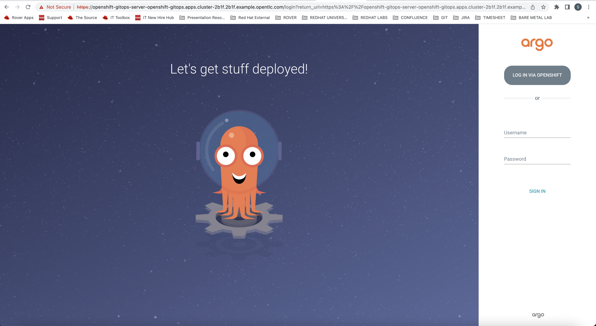
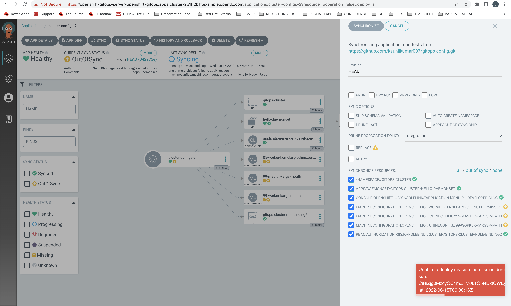
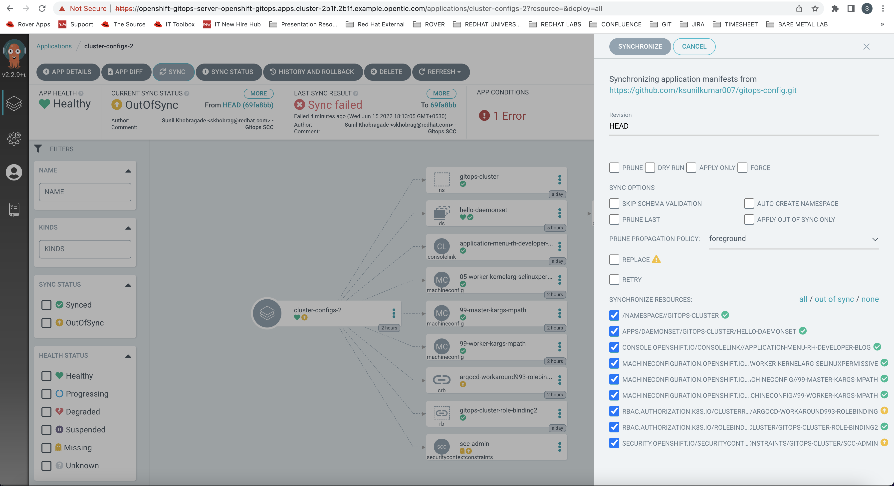
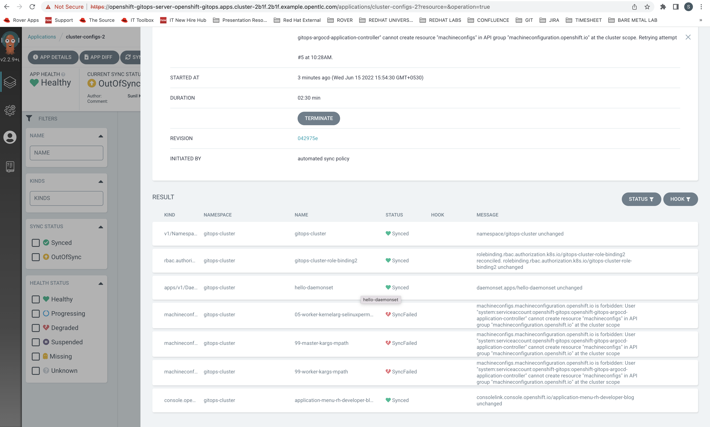

### Login to ArgoCD UI

    skhobrag@Sunils-MacBook-Pro scc % oc get routes -n openshift-gitops
    NAME                      HOST/PORT                                                                             PATH   SERVICES                  PORT    TERMINATION            WILDCARD
    cluster                   cluster-openshift-gitops.apps.cluster-2b1f.2b1f.example.opentlc.com                          cluster                   8080    reencrypt/Allow        None
    kam                       kam-openshift-gitops.apps.cluster-2b1f.2b1f.example.opentlc.com                              kam                       8443    passthrough/None       None
    openshift-gitops-server   openshift-gitops-server-openshift-gitops.apps.cluster-2b1f.2b1f.example.opentlc.com          openshift-gitops-server   https   passthrough/Redirect   None
    skhobrag@Sunils-MacBook-Pro scc %

### Open the url in the browser 

 1 Case 1 Login via OPENSHIFT 
     
     You might get the error below "Unable to deploy revision: permission denied: applications, sync, default/cluster-configs-2, sub: CiRiZjg0MzcyOC1mZTM0LTQ5NDktOWEyMC1jMjE1NDc3YjZjZTASCW9wZW5zaGlmdA"
     Follow the below step
     If you want to do that, then update the rbac stanza in your main argocd CRD in the openshift-gitops namespace:
     https://github.com/pittar-gitops/00-setup-and-documentation/blob/main/argocd-patch.yaml#L114

 2 Case 2 Login via admin and passwrod from secret named "openshift-gitops-cluste" from openshift-gitops namespace

 3 Sync the Application

### Machine Config creation gives a below error

    "machineconfigs.machineconfiguration.openshift.io is 
    forbidden:User "system:serviceaccount:openshift-gitops:openshift-gitops-argocd-application-controller" 
    cannot create resource "machineconfigs" in API group "machineconfiguration.openshift.io" at the cluster scope"

Need to create policies for the controller to manage resources. By default, it has minimal privileges

Hence ClusterRoleBinding similar to https://access.redhat.com/solutions/6012601
 
    apiVersion: rbac.authorization.k8s.io/v1
    kind: ClusterRoleBinding
    metadata:
    name: argocd-workaround993-rolebinding
    subjects:
      - kind: ServiceAccount
      name: openshift-gitops-applicationset-controller
      namespace: openshift-gitops
      - kind: ServiceAccount
      name: openshift-gitops-argocd-application-controller
      namespace: openshift-gitops
    roleRef:
      kind: ClusterRole
      name: cluster-admin
      apiGroup: rbac.authorization.k8s.io
    
    skhobrag@Sunils-MacBook-Pro machineconfig % oc create -f ClusterRoleBinding.yaml
    clusterrolebinding.rbac.authorization.k8s.io/argocd-workaround993-rolebinding created
    skhobrag@Sunils-MacBook-Pro machineconfig % oc get ClusterRoleBinding | grep argo
    argocd-workaround993-rolebinding                                            ClusterRole/cluster-admin                                                               111s
    openshift-gitops-openshift-gitops-argocd-application-controller             ClusterRole/openshift-gitops-openshift-gitops-argocd-application-controller             47h
    openshift-gitops-openshift-gitops-argocd-server                             ClusterRole/openshift-gitops-openshift-gitops-argocd-server                             47h
    skhobrag@Sunils-MacBook-Pro machineconfig %

### The Machine Config are applied

    skhobrag@Sunils-MacBook-Pro argo % oc get nodes --watch
    NAME                                              STATUS                     ROLES    AGE    VERSION
    ip-10-0-145-223.ap-southeast-1.compute.internal   Ready                      master   2d5h   v1.20.0+bafe72f
    ip-10-0-156-171.ap-southeast-1.compute.internal   Ready,SchedulingDisabled   worker   2d5h   v1.20.0+bafe72f
    ip-10-0-169-203.ap-southeast-1.compute.internal   Ready                      master   2d5h   v1.20.0+bafe72f
    ip-10-0-173-17.ap-southeast-1.compute.internal    Ready                      worker   2d5h   v1.20.0+bafe72f
    ip-10-0-230-47.ap-southeast-1.compute.internal    Ready                      worker   2d5h   v1.20.0+bafe72f
    ip-10-0-242-106.ap-southeast-1.compute.internal   Ready,SchedulingDisabled   master   2d5h   v1.20.0+bafe72f
